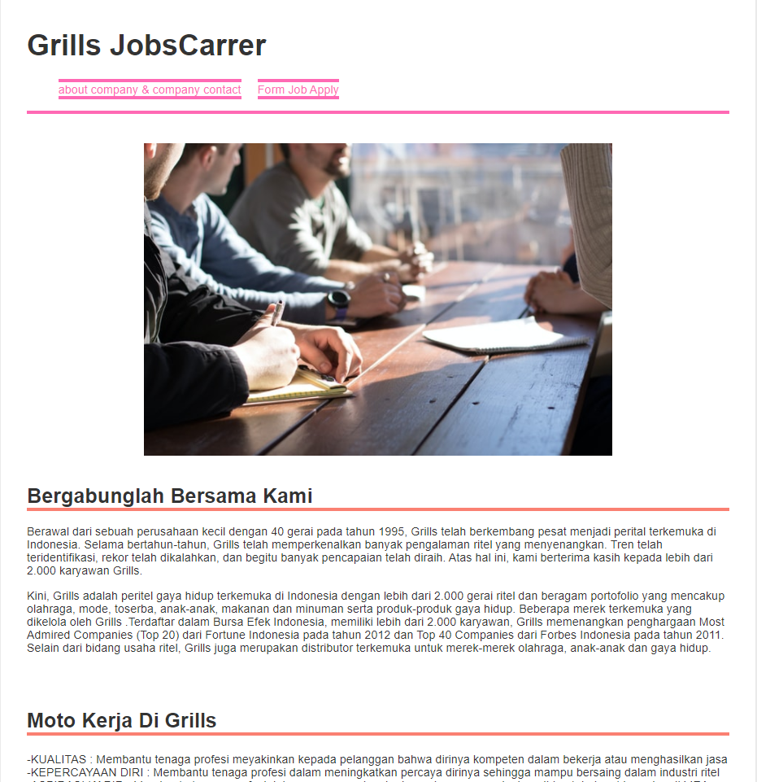
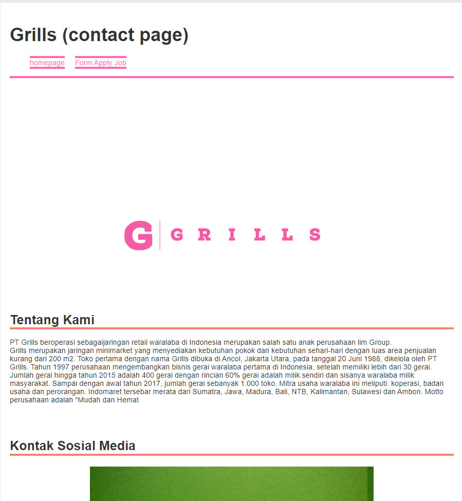
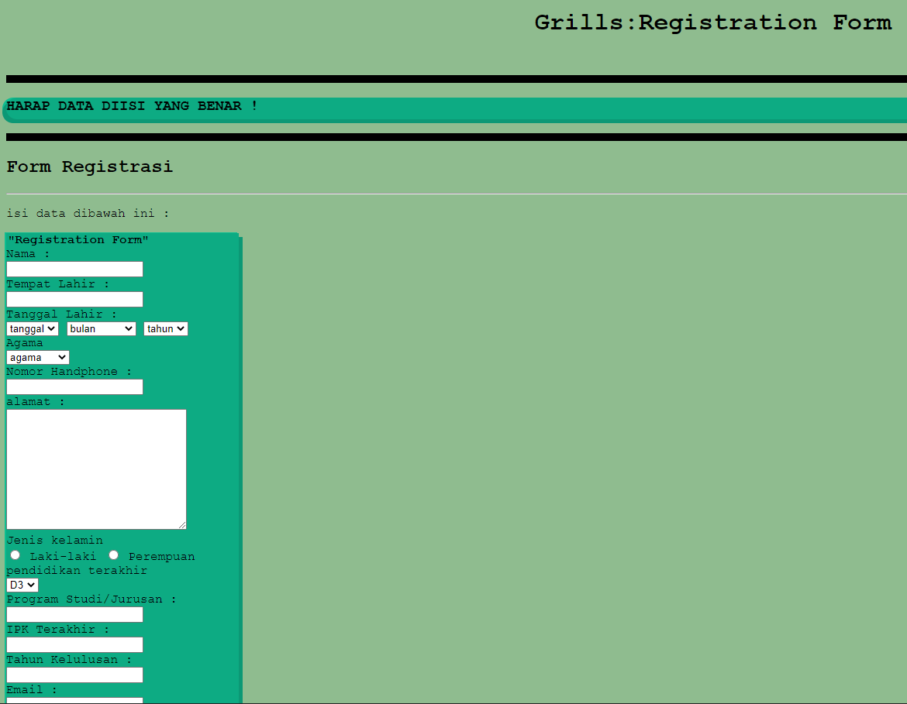
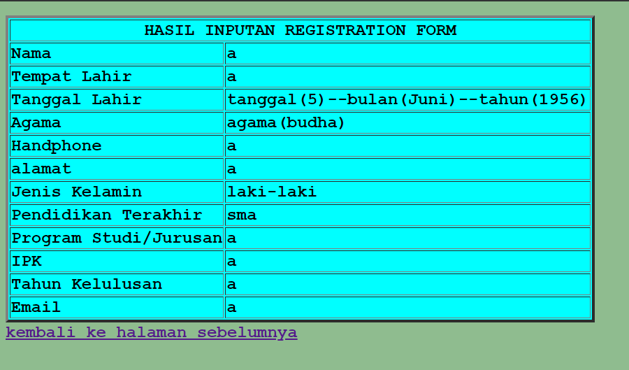

# Project Kelompok 1 (lowongan Kerja)

ini adalah project kelompok lowongan kerja berbasis website dengan menggunakan kodingan "html + css + php " .dengan anggota :

1.Andi Muhammad Yusuf Assidiq |
 2.Fadila Azhari |
 3.Nila Fadila
 
 * Fitur yang ada di website:
  1.menggunakan css

* kelebihan website:
  1.tampilan menggunakan css sehingga tampilan website menjadi lebih menarik untuk dilihat |
   2.user dapat mudah menginput form daftar kerja dengan mudah

berikut ini adalah hasil implementasi dari website yang sudah kami buat

* Homepage:

*contact page:

*input :

output:

